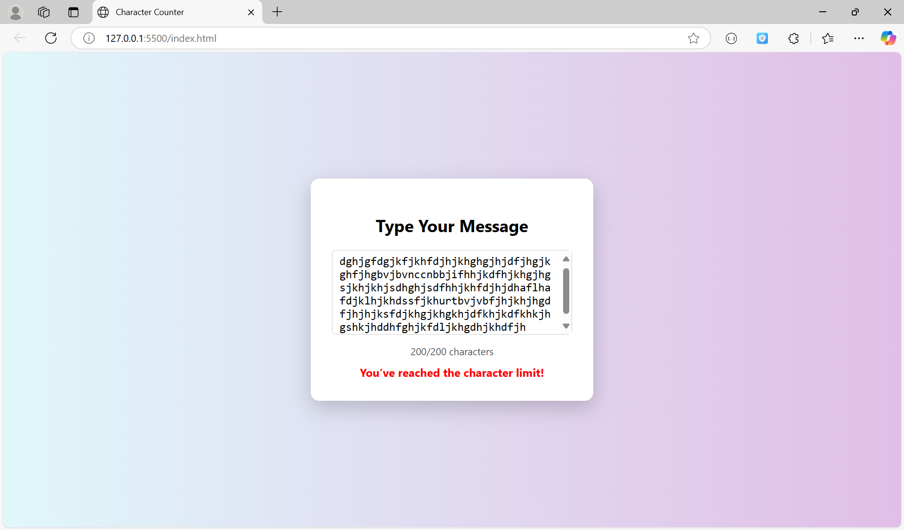

# 📝 Task 2 - Character Counter with Popup UI
I have focused on improving DOM manipulation and real-time user feedback using JavaScript.

---

## 📌 Task Description

Create a simple text area where the user can type a message, and implement a real-time character counter. The counter updates live as the user types and displays the number of characters typed and the remaining characters allowed.

---

## ✅ Features

- 🎯 Maximum character limit: **200**
- ⌨️ Real-time character tracking
- 🚫 Displays a **warning message** when limit is reached
- 🧾 Simple popup-style UI in the **center of the screen**
- 🎨 Responsive design with background gradient

---

## 💻 Technologies Used

- **HTML5** – Structure
- **CSS3** – Styling & responsiveness
- **JavaScript (Vanilla)** – Real-time logic & interaction

---

## 🖼️ UI Preview



---

## 🚀 How to Use

1. Clone or download this repository
2. Open `index.html` in your browser
3. Start typing inside the textarea
4. See the character count update in real time!

---

## 🧠 Concepts Practiced

- Event Listener (`input`)
- DOM Manipulation
- MaxLength attribute
- Responsive design
- Animation using `@keyframes`

---

## 🛠️ How to Customize

- You can change the `maxlength` value in the HTML to allow more or fewer characters.
- Modify background or popup style easily via the `.popup` and `body` CSS classes.

---


---

## 📢 Author

Made with 💙 by [Ulaganathan](https://github.com/Ulaganathan0709)  
Thanks to **Error Makes Clever** for the continuous learning support!

---

## 🧪 Live Demo

🔗 **(Optional)**: If hosted, add a live link here  
```diff
+ Live URL: https://ulaganathan0709.github.io/popup_Counter/

